# Deep Explanation: Using AI for Explaining the Results of AI

Insights regarding the decisions of a deep learning model are obtained through perturbating its inputs. Importantly, the perturbations are extracted automatically by another deep neural network. Analysis of the perturbed inputs allows identifying what parts of the input are primarily responsible for the model output. This identification can then be leveraged to explain, in human terms, the model's response. The technique described here is implemented in [pytorch](https://pytorch.org/) and then applied to explaining the outputs of a standard image recognition model ([VGG19](http://www.robots.ox.ac.uk/~vgg/research/very_deep/)).

## Outline

1. Introduction
2. Automatic perturbations
3. Pytorch implementation
4. Applications
5. Conclusions

# 1. Introduction

The application of complex machine learning algorithms to everyday problems has achieved considerable [widespread success](https://www.forbes.com/sites/bernardmarr/2016/09/30/what-are-the-top-10-use-cases-for-machine-learning-and-ai/). The machine learning paradigm replaces 'hard coding' with the learning of patterns directly from data. The adoption of machine learning may be viewed as switching to a flexible experimental approach as opposed to a 'theoretical' one in which a programmer is expected to foresee all possible situations. A drawback of this new procedure is that the mechanisms by which the machine learning algorithm reaches a decision are [not necessarily well understood](https://www.technologyreview.com/s/604087/the-dark-secret-at-the-heart-of-ai/). Understanding the logic behind algorithmic outcomes is important for a variety of reasons. One of them is preventing the algorithm from learning non-generalizable artifacts only present in the particular data used to train the machine learning model. For example, image recognition algorithms may take advantage of labeling text present on the sides of some photos. Thus, having little or no human supervision over what the model learns risks rendering it useless for practical applications. Moreover, due to the extensive use of machine learning algorithms [ethical concerns](https://abovethelaw.com/2018/04/ethical-considerations-for-artificial-intelligence/) have to be carefully considered. If anti-discrimination laws ban individuals and companies from certain behaviors, then any algorithm affecting society has to also comply with those rules. This matter is particularly pressing since the recent adoption by the European Union of new [data regulations](https://en.wikipedia.org/wiki/General_Data_Protection_Regulation). All the advantages and drawbacks mentioned above are amplified through the use of deep neural networks that allow a drastic increase in model complexity.

There have been many efforts to understand the mechanisms behind machine learning and particularly deep learning algorithms. Indeed, shortly after the introduction of the [first](https://papers.nips.cc/paper/4824-imagenet-classification-with-deep-convolutional-neural-networks.pdf) successful image recognition deep learning model, researchers devised a [perturbational approach](https://cs.nyu.edu/~fergus/papers/zeilerECCV2014.pdf) for revealing the model's inner workings. Other methods for understanding the model responses include the use of optimization algorithms (notably gradient descent which exploits the back-propagation infrastructure already built into current neural networks) for finding the inputs that [optimally activate](https://ai.stanford.edu/~ang/papers/nips09-MeasuringInvariancesDeepNetworks.pdf) certain neurons. A [Recent](https://arxiv.org/abs/1704.03296) effort combines both approaches by generating perturbations to the inputs that optimally reduce the model output. In the latter approach the perturbations are generated in part from a multiplicative mask that is then optimized by back propagation.

The present work extends the [recent approach mentioned above](https://arxiv.org/abs/1704.03296) by allowing for more arbitrary perturbations. The perturbations are now automatically generated by a convolutional neural network (CNN) inserted into the process. The CNN's weights and biases are learned through gradient descend and back-propagation. The optimum perturbation thus obtained is analyzed for identifying the input regions that are most relevant to the model's response. It is shown below that the identified important input regions can lead to intuitive interpretations of the model decisions.

# 2. Automatic perturbations

The outlines of a technique for explaining the responses of a complex deep learning model(M) are described here. A more in-depth description is given in Section 3 through the technique's pytorch implementation. As mentioned above, a [convolutional neural network (CNN)](https://en.wikipedia.org/wiki/Convolutional_neural_network) is used here for generating perturbations to the inputs of the model M. The model's maximum output element $y_{max}$ to an input $x_o$ is given by

$y_{max} = M(x_o)_k$

where, k is the index of the maximum score class for input $x_o$. The goal here is to produce a perturbed input $x_p$ that minimizes the formerly top class value, i.e.,

$M(x_p)_k \ll y_{max}$

In generating the perturbation the input $x_o$ is fed to the CNN. The output after the CNN layers is scaled to resemble the original input's range. The resulting perturbed input $x_p$ is then passed through M and its output $y_p = M(x_p)_k$ is used for calculating the loss for back-propagation:

loss = $y_p + l_1$

where $l_1 = C_{l_1}|x_o - x_p|$, and $C_{l_1}$ is an adjustable coefficient. The loss is then back-propagated and minimized by iteratively modifying the weights and biases of the CNN model. The best CNN parameters allow generating an optimum perturbed input $x_p^{opt}$ that minimizes $y_p$ while at the same time attempting to keep the perturbation $x_p^{(opt)}$ as close as possible to the original input $x_o$. This is an important requirement for avoiding artifact optimization. For instance, $y_p$ may also be minimized by $x_p$ corresponding to an image filled with zeros.

A post-processing procedure is then performed for analyzing the results. Briefly, this step consists of calculating the nonlinear difference $|x_o - x_p^{(opt)}|^6$ along with some image processing for further highlighting the important differences. This process allows identifying relevant regions in $x_o$ from the model M's point of view. 

# 3. Pytorch implementation

The details of the method outlined in Sec. 2 are presented through their implementation in [pytorch](https://pytorch.org/). The implementation below was inspired in part by the ideas discussed in [this paper](https://arxiv.org/abs/1704.03296) and its [pytorch implementation](https://github.com/jacobgil/pytorch-explain-black-box). The particular model M studied here is the VGG19 model pre-trained on the imagenet dataset for image recognition.)

## 3.1 Preliminaries

Some needed imports first:


```python
%matplotlib inline

import torch
from torchvision import models
from torch.autograd import Variable

import numpy as np
import matplotlib.pyplot as plt
from skimage import io
from skimage import transform
from skimage import morphology
from scipy.ndimage import center_of_mass
from tqdm import tqdm
import pickle
```

The warnings are sometimes distracting...


```python
import warnings
warnings.filterwarnings('ignore')
```

some parameters that will be called along the way:


```python
image_path="data/image_samples/cat.jpg"
kernel_size=3
nblocks=3
nlayers=3
epochs=1000
lr=0.01
l1_coeff=1.0
indicate_center_of_mass=True
```

and some helper functions:


```python
def use_cuda():
    return torch.cuda.is_available()


def image_tensor_to_numpy(tensor):
    img = tensor.data.cpu().numpy()[0]
    img = np.transpose(img, (1, 2, 0))
    return img
```

## 3.2 Load the model (to be analyzed) and original image (to be perturbated)

### The model (M above):


```python
def load_vgg_model():
    model = models.vgg19(pretrained=True)
    model.eval()

    if use_cuda():
        model.cuda()

    for p in model.features.parameters():
        p.requires_grad = False

    for p in model.classifier.parameters():
            p.requires_grad = False

    return model


vgg_model = load_vgg_model()
print vgg_model
```

    VGG(
      (features): Sequential(
        (0): Conv2d(3, 64, kernel_size=(3, 3), stride=(1, 1), padding=(1, 1))
        (1): ReLU(inplace)
        (2): Conv2d(64, 64, kernel_size=(3, 3), stride=(1, 1), padding=(1, 1))
        (3): ReLU(inplace)
        (4): MaxPool2d(kernel_size=2, stride=2, padding=0, dilation=1, ceil_mode=False)
        (5): Conv2d(64, 128, kernel_size=(3, 3), stride=(1, 1), padding=(1, 1))
        (6): ReLU(inplace)
        (7): Conv2d(128, 128, kernel_size=(3, 3), stride=(1, 1), padding=(1, 1))
        (8): ReLU(inplace)
        (9): MaxPool2d(kernel_size=2, stride=2, padding=0, dilation=1, ceil_mode=False)
        (10): Conv2d(128, 256, kernel_size=(3, 3), stride=(1, 1), padding=(1, 1))
        (11): ReLU(inplace)
        (12): Conv2d(256, 256, kernel_size=(3, 3), stride=(1, 1), padding=(1, 1))
        (13): ReLU(inplace)
        (14): Conv2d(256, 256, kernel_size=(3, 3), stride=(1, 1), padding=(1, 1))
        (15): ReLU(inplace)
        (16): Conv2d(256, 256, kernel_size=(3, 3), stride=(1, 1), padding=(1, 1))
        (17): ReLU(inplace)
        (18): MaxPool2d(kernel_size=2, stride=2, padding=0, dilation=1, ceil_mode=False)
        (19): Conv2d(256, 512, kernel_size=(3, 3), stride=(1, 1), padding=(1, 1))
        (20): ReLU(inplace)
        (21): Conv2d(512, 512, kernel_size=(3, 3), stride=(1, 1), padding=(1, 1))
        (22): ReLU(inplace)
        (23): Conv2d(512, 512, kernel_size=(3, 3), stride=(1, 1), padding=(1, 1))
        (24): ReLU(inplace)
        (25): Conv2d(512, 512, kernel_size=(3, 3), stride=(1, 1), padding=(1, 1))
        (26): ReLU(inplace)
        (27): MaxPool2d(kernel_size=2, stride=2, padding=0, dilation=1, ceil_mode=False)
        (28): Conv2d(512, 512, kernel_size=(3, 3), stride=(1, 1), padding=(1, 1))
        (29): ReLU(inplace)
        (30): Conv2d(512, 512, kernel_size=(3, 3), stride=(1, 1), padding=(1, 1))
        (31): ReLU(inplace)
        (32): Conv2d(512, 512, kernel_size=(3, 3), stride=(1, 1), padding=(1, 1))
        (33): ReLU(inplace)
        (34): Conv2d(512, 512, kernel_size=(3, 3), stride=(1, 1), padding=(1, 1))
        (35): ReLU(inplace)
        (36): MaxPool2d(kernel_size=2, stride=2, padding=0, dilation=1, ceil_mode=False)
      )
      (classifier): Sequential(
        (0): Linear(in_features=25088, out_features=4096, bias=True)
        (1): ReLU(inplace)
        (2): Dropout(p=0.5)
        (3): Linear(in_features=4096, out_features=4096, bias=True)
        (4): ReLU(inplace)
        (5): Dropout(p=0.5)
        (6): Linear(in_features=4096, out_features=1000, bias=True)
      )
    )


### The image (xo above):


```python
def load_image(image_path, graph=True):
    img = io.imread(image_path)

    if graph:
        plt.figure("original image")
        plt.imshow(img)

    return img


img = load_image(image_path)
```


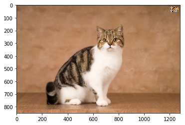


## 3.3 Transforming the image to a torch tensor

The image (currently a numpy ndarray) is transformed to a torch tensor and then scaled to a value range suitable for the vgg_model.


```python
def image_to_vgg_input_tensor(img):
    preprocessed_img = transform.resize(img, (224, 224))
    preprocessed_img = np.float32(preprocessed_img.copy())
    preprocessed_img = preprocessed_img[:, :, ::-1]

    means=[0.485, 0.456, 0.406]
    stds=[0.229, 0.224, 0.225]

    for i in range(3):
        preprocessed_img[:, :, i] =\
            preprocessed_img[:, :, i] - means[i]
        preprocessed_img[:, :, i] =\
            preprocessed_img[:, :, i] / stds[i]

    preprocessed_img = np.ascontiguousarray(
        np.transpose(preprocessed_img, (2, 0, 1))
    )

    if use_cuda():
        preprocessed_img_tensor =\
            torch.from_numpy(preprocessed_img).cuda()
    else:
        preprocessed_img_tensor =\
            torch.from_numpy(preprocessed_img)

    preprocessed_img_tensor.unsqueeze_(0)

    return Variable(preprocessed_img_tensor, requires_grad = False)


img_tensor = image_to_vgg_input_tensor(img)
print type(img_tensor)
print img_tensor.shape
```

    <class 'torch.Tensor'>
    torch.Size([1, 3, 224, 224])


To visualize the scaling changes:


```python
proc_img_np = image_tensor_to_numpy(img_tensor)
proc = np.mean(proc_img_np, axis=2) # to see in 2D plot average over the color values

plt.pcolormesh(proc[::-1, :])
plt.colorbar()
ax = plt.gca()
ax.set_aspect(1)
__ = plt.title("Vizualization of image transformed to torch tensor")
```


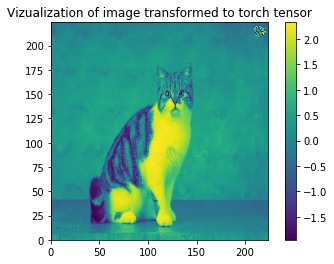


## 3.4 Assessing the model's performance on the image


```python
def vgg_input_assessment(input_tensor, vgg_model):
    with open("data/imagenet1000_clsid_to_human.pkl", "r") as fp:
        vgg_class = pickle.load(fp)

    outputs = torch.nn.Softmax()(vgg_model(input_tensor))
    outputs_np = outputs.data.cpu().numpy()
    sorted_args = np.argsort(outputs_np[0, :])[::-1]

    print "5 top classes identified by the model:"
    print "(class index) class description: model score"

    for index in sorted_args[:5]:
        print "({}) {}: {}".format(index, vgg_class[index], outputs[0, index])

    print

    if outputs_np[0, sorted_args[0]] < 0.5:
        print "*** Warning ***"
        print "top category score under 0.5, extracted explanation may not be accurate on not well defined class"
        print
        
        
vgg_input_assessment(img_tensor, vgg_model)
```

    5 top classes identified by the model:
    (class index) class description: model score
    (281) tabby, tabby cat: 0.802203714848
    (282) tiger cat: 0.124585837126
    (285) Egyptian cat: 0.0701399073005
    (283) Persian cat: 0.00106593884993
    (539) doormat, welcome mat: 0.000402584497351
    


## 3.5 Build the perturbations generator

For easy use of pytorch's gradient back-propagation, the perturbation is defined here as a pytorch module. The padding of the conv layers is set such that the layer output has the same shape as the input (similar to the padding="same" setting in keras). This is important since the tensor has to keep the same dimensions to act as a 'perturbation' of the input.


```python
class PerturbationsGenerator(torch.nn.Module):
    def __init__(self, kernel_size=3, nblocks=3, nlayers=3):
        super(PerturbationsGenerator, self).__init__()
        # build conv layers, implement padding='same':
        if np.mod(kernel_size, 2) == 0: kernel_size += 1
        padding = kernel_size // 2
        self.conv = torch.nn.Conv2d(
            3, 3, kernel_size = kernel_size,
            padding = padding,
        )
        self.relu = torch.nn.ReLU()
        self.nblocks = nblocks
        self.nlayers = nlayers

        if use_cuda(): self.cuda()

    def forward(self, x):
        # gather information for scaling
        xmin = torch.min(x)
        Dx = torch.max(x - xmin)

        # perturbate the image:
        for __ in range(self.nblocks):
            for __ in range(self.nlayers):
                x = self.conv(x)
            x = self.relu(x)

        # scale to original input range:
        x = x.add(- torch.min(x))  # x: zero to something
        x = x.div(torch.max(x))  # x: zero to 1
        x = x.mul(Dx)  # x: zero to Dx
        x = x.add(xmin)  # x: xmin to xmin + Dx

        if use_cuda(): x.cuda()

        return x
    

pert_model = PerturbationsGenerator(
    kernel_size, nblocks, nlayers,
)
```

As defined in the "forward" method, the input tensor goes through blocks of convolutional layers after which it is scaled to the range of the original input (as mentioned above, the original input has a suitable range for the vgg_model). This last step is required since the perturbated tensor x will be fed as input to vgg_model, which requires its input values to be within a pre-defined range.

## 3.6 Find an optimum perturbation

The following code back-propagates small changes to the loss and optimizes the CNN weights and biases through gradient descent. This results in CNN parameters that generate an optimum perturbation (pert_img_tensor).

Since the CNN parameters were defined within a pytorch module using native functions, it is very simple to setup the optimizer on these parameters by just invoking:

torch.optim.Adam(pert_model.parameters(), lr).

As mentioned above, the loss is defined as the value of the maximum class (for the original image) plus a measure of how different is the perturbated image from the original one.


```python
def get_optimum_perturbation(
        epochs, pert_model, img, vgg_model,
        lr=0.1, l1_coeff=0.01,
):
    optimizer = torch.optim.Adam(
        pert_model.parameters(), lr=lr
    )
    target = torch.nn.Softmax()(vgg_model(img))
    category = np.argmax(target.cpu().data.numpy())
    print "Category with highest probability", category
    print "Optimizing.. "
    losses = []

    for i in tqdm(range(epochs)):
        pert_img = pert_model(img)
        outputs = torch.nn.Softmax()(vgg_model(pert_img))
        img_diff = img - pert_img
        l1_term = l1_coeff * torch.mean(torch.abs(torch.pow(img_diff, 1)))
        loss = l1_term + outputs[0, category]
        losses.append(loss.data[0])
        optimizer.zero_grad()
        loss.backward()
        optimizer.step()

    # plot the loss:
    plt.figure("loss")
    plt.plot(losses)
    plt.xlabel("epoch")
    plt.ylabel("loss")

    print "original score: {}".format(torch.nn.Softmax()(vgg_model(img))[0, category])
    print "perturbed score: {}".format(torch.nn.Softmax()(vgg_model(pert_img))[0, category])

    return pert_img


pert_img_tensor = get_optimum_perturbation(
    epochs, pert_model, img_tensor,
    vgg_model=vgg_model,
    lr=lr, l1_coeff=l1_coeff,
)
```

      0%|          | 4/1000 [00:00<00:29, 33.38it/s]

    Category with highest probability 281
    Optimizing.. 


    100%|██████████| 1000/1000 [00:25<00:00, 39.33it/s]


    original score: 0.802203714848
    perturbed score: 0.000889057584573


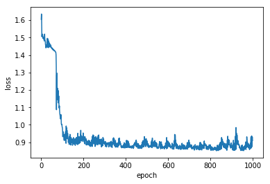


The optimization generated perturbed inputs that drastically pushed down the vgg_model's score by three orders of magnitude. 

The loss history above is rather noisy. Since there is only one sample here, one cannot simply increase the batch size. The learning rate can be decreased, but going too far may end up with the optimizer not optimizing.

To visualize the changes, the optimum perturbated image is plotted along the original one:


```python
processed_img = image_tensor_to_numpy(img_tensor)
pert_img = image_tensor_to_numpy(pert_img_tensor)
proc = np.mean(processed_img, axis=2)
pert = np.mean(pert_img, axis=2)

fig, (ax1, ax2) = plt.subplots(
    ncols=2, figsize=(15, 5),
)
fig.canvas.set_window_title("images")

im1 = ax1.pcolormesh(proc[::-1, :])
fig.colorbar(im1, ax=ax1, fraction=0.046)
ax1.set_aspect(1)
ax1.set_title("processed original image")

im2 = ax2.pcolormesh(pert[::-1, :])
fig.colorbar(im2, ax=ax2, fraction=0.046)
ax2.set_aspect(1)
ax2.set_title("perturbated image")

fig.tight_layout()
```


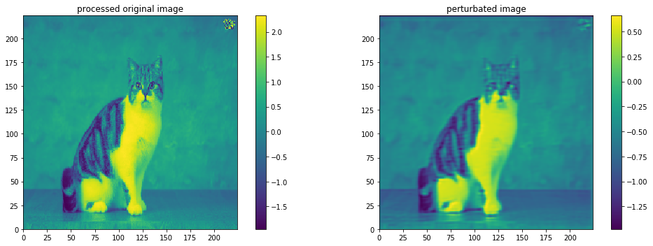


As intended, the perturbated image does not diverge much from the original image. The image background is minimally affected by the perturbation while, on the other hand, the cat's features are considerably distorted. The [related previous work](https://arxiv.org/abs/1704.03296) mentioned above applies an optimized attenuating mask to identify the important parts of the image. [The CNN-constructed perturbation here](https://github.com/roberto1648/deep-explanation-using-ai-for-explaining-the-results-of-ai/blob/master/deep_explanation.py) can customize the operations applied to the image (as opposed to only attenuating its pixels). Moreover, the convolutional layers may nonlinearly mix the pixels in producing the optimum perturbation.

Notice that the small cartoon at the upper right corner (that contains a cat face) has also been considerably modified by the perturbation.

## 3.7 Post-processing

In this step:
- The tensors are transformed from torch to numpy arrays.
- A power of the difference between the original and perturbated images is calculated and then processed to highlight the image portions that are seemingly most important in the vgg_model assigning a class to this particular image. The difference is elevated here to a relatively high power (sixth). This works as a form of thresholding. Other powers may be used for different models.
- Features too close to the edge of the image are removed. This is for preventing possible artifacts that may be introduced due to padding with zeros during the convolution operations. A drawback is that valid features close to the edges (e.g., as the inserted cat face at the upper right corner) can be missed. For most cases of interest the main image class is expected to be well represented within the image.


```python
def post_processing(proc_img_tensor, pert_img_tensor):
    proc_img_np = image_tensor_to_numpy(proc_img_tensor)
    pert_img_np = image_tensor_to_numpy(pert_img_tensor)

    # mean over image channels:
    proc = np.mean(proc_img_np, axis=2)
    pert = np.mean(pert_img_np, axis=2)

    # highlighting the differences:
    diff = (proc - pert) ** 6

    # remove the edges: artifacts due to padding may appear.
    h, w = np.shape(diff)
    diff[:int(0.1 * h), :] = 0
    diff[int(0.9 * h):, :] = 0
    diff[:, :int(0.1 * w)] = 0
    diff[:, int(0.9 * w):] = 0

    # dilate the important points left for visibility:
    square = np.ones((20, 20))
    diff = morphology.dilation(diff, square)

    return diff, proc_img_np, pert_img_np


diff, proc_img_np, pert_img_np = post_processing(
    img_tensor, pert_img_tensor,
)
```

The extracted processed differences are plotted alongside the original and perturbed images:


```python
def plot_results(
    processed_img, pert_img, diff,
    indicate_center_of_mass=False,
):
    proc = np.mean(processed_img, axis=2)
    pert = np.mean(pert_img, axis=2)
    loc = center_of_mass(diff[::-1, :])

    fig, (ax1, ax2, ax3) = plt.subplots(
        ncols=3, figsize=(15, 5),
    )
    fig.canvas.set_window_title("images")

    im1 = ax1.pcolormesh(proc[::-1, :])
    fig.colorbar(im1, ax=ax1, fraction=0.046)
    ax1.set_aspect(1)
    ax1.set_title("processed image")

    im2 = ax2.pcolormesh(pert[::-1, :])
    fig.colorbar(im2, ax=ax2, fraction=0.046)
    ax2.set_aspect(1)
    ax2.set_title("perturbated image")

    im3 = ax3.pcolormesh(diff[::-1, :], cmap='Greys')
    fig.colorbar(im3, ax=ax3, fraction=0.046)
    ax3.set_aspect(1)
    ax3.set_title("differences")
    if indicate_center_of_mass:
        ax3.annotate("X: center of mass", loc)

    fig.tight_layout()
    plt.show()


plot_results(
    proc_img_np, pert_img_np, diff,
    indicate_center_of_mass=indicate_center_of_mass,
)
```


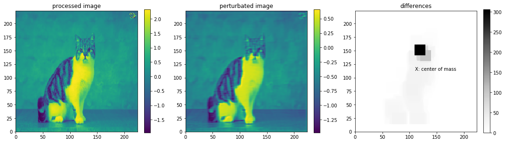


Notice how the cat's body is roughly outlined in the differences plot. Also, the most important features are located around the cat's head. Also shown is the center of mass calculated from the values and coordinates of all points in the differences matrix. The center of mass could be used for extracting an approximated location of a class in an image when a single instance of the class is present. For cases in which many class instances are present in the same image a clustering algorithm may be used to find their places.

# 4. Applications

The program is now applied to several (i.e., cat and non-cat) [images](https://github.com/roberto1648/deep-explanation-using-ai-for-explaining-the-results-of-ai/tree/master/data/image_samples). All the functions above can be found in [deep_explanation.py](https://github.com/roberto1648/deep-explanation-using-ai-for-explaining-the-results-of-ai/blob/master/deep_explanation.py) alongside the main() function that runs all the steps.


```python
import deep_explanation

proc_img_np, pert_img_np, diff = deep_explanation.main(
    image_path="data/image_samples/cat2.jpg",
    kernel_size=3,
    nblocks=2,
    nlayers=3,
    epochs=1000,
    lr=0.01,
    l1_coeff=1.0,
    indicate_center_of_mass=True,
)
```

      0%|          | 5/1000 [00:00<00:24, 41.38it/s]

    5 top classes identified by the model:
    (class index) class description: model score
    (285) Egyptian cat: 0.50977897644
    (281) tabby, tabby cat: 0.208158865571
    (282) tiger cat: 0.0818989351392
    (904) window screen: 0.0630929172039
    (905) window shade: 0.0317366085947
    
    Category with highest probability 285
    Optimizing.. 


    100%|██████████| 1000/1000 [00:24<00:00, 41.28it/s]


    original score: 0.50977897644
    perturbed score: 0.00078588409815


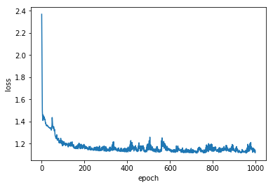


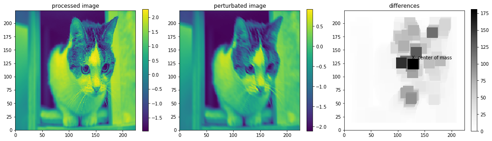


For some reason this cat image was problematic in other similar programs I have worked on before. The program performs reasonably well here.


```python
proc_img_np, pert_img_np, diff = deep_explanation.main(
    image_path="data/image_samples/dog.jpg",
    kernel_size=3,
    nblocks=2,
    nlayers=3,
    epochs=1000,
    lr=0.01,
    l1_coeff=1.0,
    indicate_center_of_mass=True,
)
```

      0%|          | 5/1000 [00:00<00:23, 41.78it/s]

    5 top classes identified by the model:
    (class index) class description: model score
    (222) kuvasz: 0.823425173759
    (257) Great Pyrenees: 0.141241371632
    (207) golden retriever: 0.0236044339836
    (208) Labrador retriever: 0.00311248097569
    (229) Old English sheepdog, bobtail: 0.00158786645625
    
    Category with highest probability 222
    Optimizing.. 


    100%|██████████| 1000/1000 [00:23<00:00, 41.67it/s]


    original score: 0.823425173759
    perturbed score: 0.000324941589497


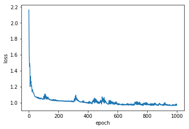


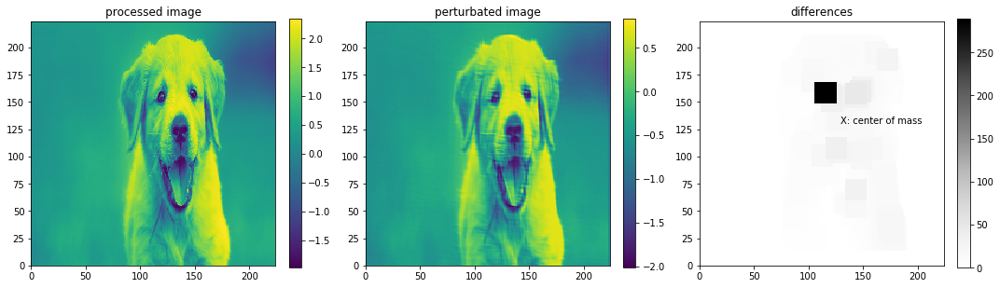


The darkest point coincides with one of the eyes. Notice the horizontal striations inserted by the program on the puppy's face. The original image has some of such striations (e.g., by coordinates (110, 120)). It appears that the program used the striations as "seed" perturbations and then exaggerated/propagated them. By their nature, the convolutional layers can easily accomplish such feature propagation through the image.


```python
proc_img_np, pert_img_np, diff = deep_explanation.main(
    image_path="data/image_samples/car.jpg",
    kernel_size=3,
    nblocks=2,
    nlayers=3,
    epochs=1000,
    lr=0.01,
    l1_coeff=1.0,
    indicate_center_of_mass=True,
)
```

      0%|          | 5/1000 [00:00<00:24, 41.01it/s]

    5 top classes identified by the model:
    (class index) class description: model score
    (817) sports car, sport car: 0.530656099319
    (479) car wheel: 0.131468653679
    (581) grille, radiator grille: 0.109313197434
    (511) convertible: 0.103721126914
    (436) beach wagon, station wagon, wagon, estate car, beach waggon, station waggon, waggon: 0.0631403699517
    
    Category with highest probability 817
    Optimizing.. 


    100%|██████████| 1000/1000 [00:23<00:00, 42.38it/s]


    original score: 0.530656099319
    perturbed score: 0.00144367048051


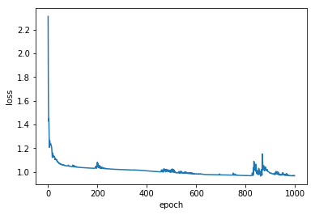


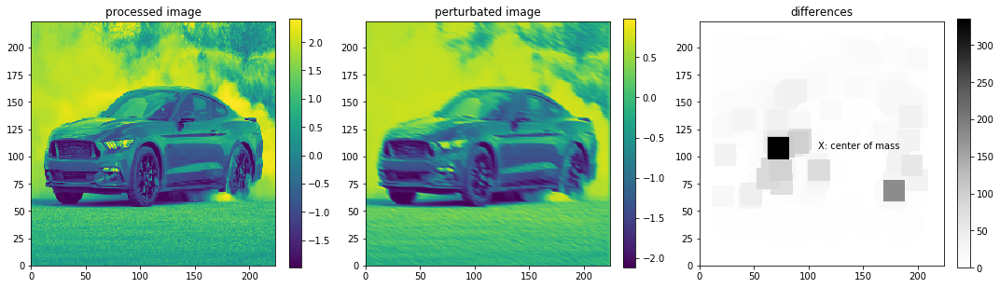


The darkest spot corresponds here to the headlight and there are other important differences by the tires.


```python
proc_img_np, pert_img_np, diff = deep_explanation.main(
    image_path="data/image_samples/excavator.jpg",
    kernel_size=3,
    nblocks=2,
    nlayers=3,
    epochs=1000,
    lr=0.01,
    l1_coeff=1.0,
    indicate_center_of_mass=True,
)
```

      0%|          | 5/1000 [00:00<00:24, 41.34it/s]

    5 top classes identified by the model:
    (class index) class description: model score
    (517) crane: 0.965572297573
    (913) wreck: 0.020407076925
    (595) harvester, reaper: 0.00241595739499
    (510) container ship, containership, container vessel: 0.00212941667996
    (730) plow, plough: 0.000826664734632
    
    Category with highest probability 517
    Optimizing.. 


    100%|██████████| 1000/1000 [00:24<00:00, 40.34it/s]


    original score: 0.965572297573
    perturbed score: 0.000938760233112


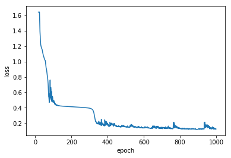


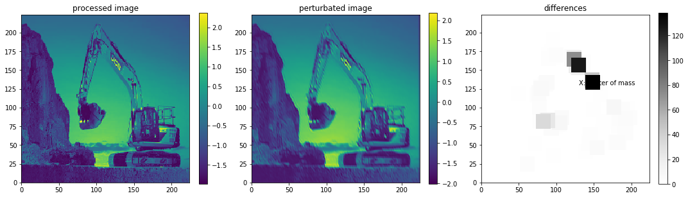


The arm of the excavator is highlighted here. Notice that, according to the vgg_model, the top class was supposed to be here "crane" in which case the arm would indeed be a more important feature than the tip.


```python
proc_img_np, pert_img_np, diff = deep_explanation.main(
    image_path="data/image_samples/palace.jpg",
    kernel_size=3,
    nblocks=2,
    nlayers=3,
    epochs=1000,
    lr=0.01,
    l1_coeff=1.0,
    indicate_center_of_mass=True,
)
```

      0%|          | 5/1000 [00:00<00:24, 40.33it/s]

    5 top classes identified by the model:
    (class index) class description: model score
    (483) castle: 0.782301783562
    (975) lakeside, lakeshore: 0.037042953074
    (576) gondola: 0.0343679413199
    (833) submarine, pigboat, sub, U-boat: 0.0290066376328
    (536) dock, dockage, docking facility: 0.0265274904668
    
    Category with highest probability 483
    Optimizing.. 


    100%|██████████| 1000/1000 [00:23<00:00, 41.82it/s]


    original score: 0.782301783562
    perturbed score: 0.0055736429058


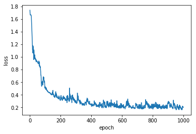


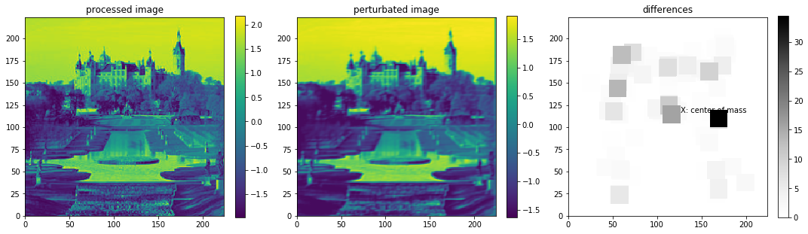


One thing here is that it seems that many castles/palaces have stairs and some body of water around them. Still many relevant points group around the actual castle.


```python
proc_img_np, pert_img_np, diff = deep_explanation.main(
    image_path="data/image_samples/image_admixture.gif",
    kernel_size=3,
    nblocks=3,
    nlayers=3,
    epochs=1000,
    lr=0.01,
    l1_coeff=1.0,
    indicate_center_of_mass=True,
)
```

      0%|          | 4/1000 [00:00<00:25, 38.95it/s]

    5 top classes identified by the model:
    (class index) class description: model score
    (644) matchstick: 0.356368899345
    (401) accordion, piano accordion, squeeze box: 0.104134827852
    (509) confectionery, confectionary, candy store: 0.0491409525275
    (769) rule, ruler: 0.0386349000037
    (868) tray: 0.0335290394723
    
    *** Warning ***
    top category score under 0.5, extracted explanation may not be accurate on not well defined class
    
    Category with highest probability 644
    Optimizing.. 


    100%|██████████| 1000/1000 [00:26<00:00, 37.34it/s]


    original score: 0.356368899345
    perturbed score: 0.00428548082709


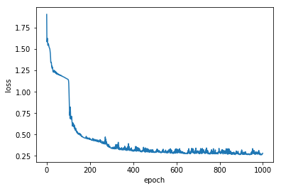


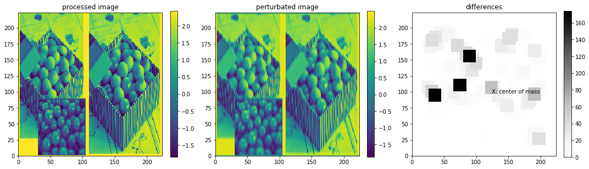


This one was hard enough so as to confuse VGG (and trigger my little warning). Since the supposed highest class here was "matchstick", the program highlighted the edges around two of the boxes in the image: the boxes' edges do resemble matches.

As seen in the examples above, the program developed here not only roughly finds the area occupied by the top class, but also points to individual features of the located object. In the case of VGG19 the highlighted features both make intuitive sense and confirm the quality of the model.

# 5. Conclusions

An algorithm was developed for extracting information about the criteria used by an image recognition model in classifying images. The algorithm finds an optimum perturbation that minimizes the top class score while attempting to keep the image as close as possible to the original image. Importantly, the perturbations are designed by a convolutional neural network (CNN) whose weights and biases are optimized to produce an optimum perturbation. The use of a CNN for generating perturbations allows for a variety of nonlinear perturbations that are customized to the particular image.

Highlighting the important parts of the inputs made intuitive sense here for the case of images. Similarly, for text or video models the program may be able to highlight crucial words or features in particular frames, respectively. Since the form of the perturbations is learned by the CNN, no expert knowledge is required in applying the developed program for a variety of models.

Due to its reliance on pytorch's built-in back-propagation, the particular implementation given here is limited to analyzing models implemented in pytorch. The number of such models is currently growing along with pytorch's raising popularity. It might be possible to analyze other (i.e., not implemented yet in pytorch) models by sampling the class scores for various images such that an approximate linear or polynomial inverse model could be obtained. This can then be used to define the "backward" method of the model in pytorch.
